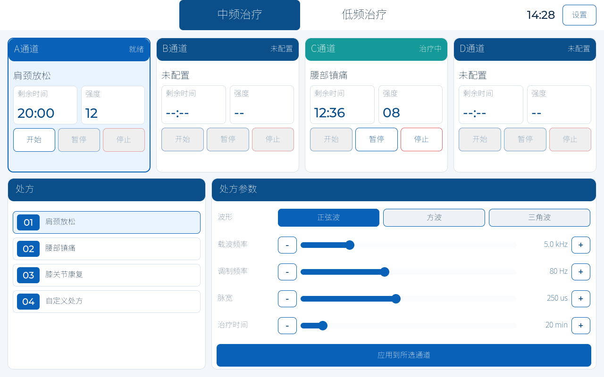
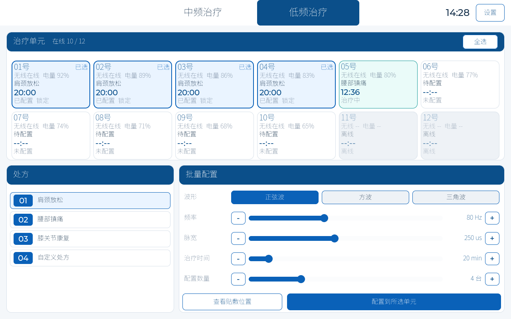

# STIM LVGL PC Simulator

低中频治疗仪 1280 × 800 桌面 UI 模拟器。工程使用同一套 LVGL UI 和模拟业务状态，在 macOS 与 Windows 上分别编译；SDL2 只负责桌面窗口、鼠标和键盘输入。

## 当前页面与交互

- 顶部 `中频治疗 / 低频治疗` 双 Tab。
- 中频页：A–D 四通道、通道选择、开始/暂停/继续/停止、处方选择、波形和参数调节、应用处方。
- 低频页：12 个无线治疗单元、在线/离线/配置/运行状态、单选/全选、批量配置、贴敷位置提示。
- 运行中的通道和治疗单元每秒倒计时。
- `设置` 和 `查看贴敷位置` 已接入占位弹窗。
- 支持命令行输出 BMP 截图，便于视觉回归检查。

> UI 中的治疗参数只用于展示控件和状态机，不代表产品默认治疗参数，也不可直接用于人体治疗。正式参数、上下限、故障恢复和权限必须经过产品、硬件与法规评审。

## 当前界面

中频通道页：



低频接收器页：



## 依赖

- CMake 3.24+
- macOS：Apple Clang/Xcode Command Line Tools
- Windows：Visual Studio 2022，安装“Desktop development with C++”
- 首次配置需要网络，用于获取固定版本：LVGL v9.5.0、SDL2 release-2.32.10

SDL2 会由 CMake 从源码构建，不要求用户预先安装 Homebrew SDL、vcpkg 或 SDL DLL。

## macOS 构建与运行

```bash
cd stim-simulator
cmake --preset macos-debug
cmake --build --preset macos-debug -j
ctest --preset macos-debug
./out/build/macos-debug/bin/stim-simulator
```

生成两张页面截图：

```bash
./out/build/macos-debug/bin/stim-simulator \
  --screen medium --screenshot medium.bmp

./out/build/macos-debug/bin/stim-simulator \
  --screen low --screenshot low.bmp
```

## Windows 构建与运行

在 “Developer PowerShell for VS 2022” 中运行：

```powershell
cd stim-simulator
cmake --preset windows-debug
cmake --build --preset windows-debug
ctest --preset windows-debug
.\out\build\windows-debug\bin\Debug\stim-simulator.exe
```

Release 构建：

```powershell
cmake --preset windows-release
cmake --build --preset windows-release
.\out\build\windows-release\bin\Release\stim-simulator.exe
```

## 目录

```text
stim-simulator/
├── assets/fonts/       # 裁剪后的跨平台 LVGL 中文字库
├── src/model/          # 无 LVGL/SDL 依赖的模拟治疗状态模型
├── src/platform/       # SDL 显示、输入与截图
├── src/ui/             # 可迁移的 LVGL 页面和组件
├── tests/              # 状态模型单元测试
├── CMakeLists.txt
├── CMakePresets.json
└── lv_conf.h
```

## 资源边界

- PC 模拟器使用 1280 × 800、32-bit 色深和 8 MiB LVGL 内存池；SDL 显示缓冲约 4.1 MiB。这些是桌面验证配置，不是目标硬件 RAM 需求。
- 中文字库基于 Noto Sans SC，按当前 UI 字符集合裁剪为 16/20/24 px，许可证见 `assets/fonts/OFL.txt`。
- `src/model` 不引用 LVGL 或 SDL，可替换为真实通信协议/治疗状态数据源。
- `src/ui` 不包含 MCU 寄存器、显示总线或触摸控制器代码；迁移硬件时替换 `src/platform`。
